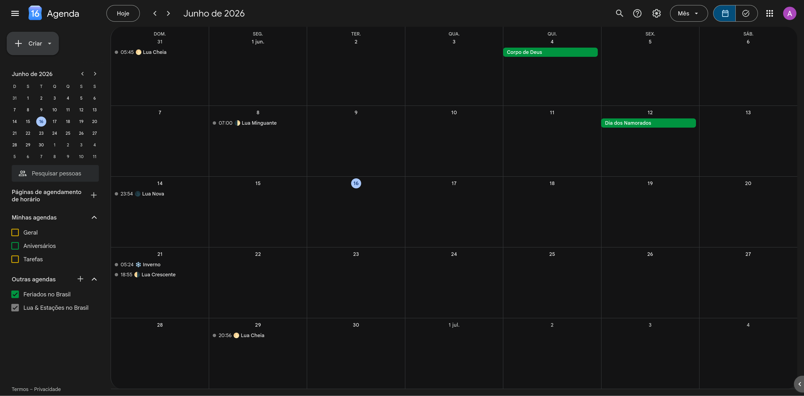

## Sobre

Senti a necessidade de ter no Google Agenda um calendário astronômico mais completo, que exibisse não apenas as fases da Lua, mas também as estações do ano, incluindo a data e o horário exatos de início de cada evento.

Embora o Google Agenda ofereça suporte nativo às fases da Lua, a apresentação é bastante limitada, sem ícones ou informações detalhadas. Ao procurar alternativas em formato iCalendar (`.ics`), encontrei diversas opções gratuitas e pagas, muitas delas incompletas ou focadas exclusivamente no hemisfério norte.

Uma referência importante para este projeto foi o calendário astronômico disponibilizado por [Canton Becker](https://cantonbecker.com/astronomy-calendar/).

Com o auxílio de inteligência artificial e dados astronômicos obtidos em [Time and Date](https://www.timeanddate.com/), o calendário foi adaptado para o contexto brasileiro:

- Tradução completa para português do Brasil (pt-BR);
- Inclusão das estações do ano do hemisfério sul e respectivos ícones;
- Ajuste da representação visual das fases da Lua para o hemisfério sul;
- Cobertura de Janeiro de 2025 a Dezembro de 2100.

## Preview
<p align="center">
  
</p>

## Atualizações

Este calendário é mantido continuamente. Caso sejam identificadas correções ou melhorias, o arquivo será atualizado neste repositório.

## Adicionar

```text
webcal://raw.githubusercontent.com/lxwndr/astrocal/main/astrocal.ics
```

```text
https://raw.githubusercontent.com/lxwndr/astrocal/main/astrocal.ics
```

Ao adicionar este calendário ao seu aplicativo de agenda, as atualizações serão recebidas automaticamente, de acordo com a frequência de sincronização do aplicativo utilizado.
